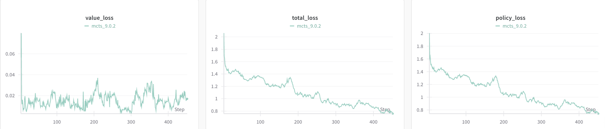

# 基于深度强化学习的五子棋AI框架 (MCTS / PPO 尝试)

## 项目简介

本项目旨在探索和实现基于深度强化学习的五子棋AI，主要尝试了**Proximal Policy Optimization (PPO)** 算法和 **AlphaZero**算法的核心思想。通过自我对弈（Self-Play）或与固定对手对战，让AI从零开始学习五子棋的策略，最终目标是培养出一个具备较高棋力的五子棋AI。

## 蒙特卡洛树搜索（MCTS）的思想与简要介绍

**蒙特卡洛树搜索（MCTS）** 是一种用于决策过程的启发式搜索算法，尤其在具有巨大搜索空间的游戏（如围棋、象棋）AI中表现卓越。它的核心思想是通过**随机模拟（蒙特卡洛方法）**来评估给定状态下不同行动的价值，并利用这些评估来指导**搜索树的构建和遍历**。

MCTS 的强大之处在于它能够在不完全展开整个搜索树的情况下，高效地找到最佳或接近最佳的决策。它通过以下四个关键步骤**迭代地构建搜索树**：

1.  **选择 (Selection)：** 从根节点开始，算法根据**UCB1 (Upper Confidence Bound 1) 公式**遍历已经存在的搜索树，选择当前最具潜力的子节点。UCB1 平衡了节点的**探索（访问次数少）**和**利用（回报高）**，鼓励算法既能探索新的未知区域，也能利用已知的高价值路径。
    *   UCB1 公式：
        $$ Q(s, a) + C \sqrt{\frac{\ln N(s)}{N(s, a)}} $$
        其中 $Q(s, a)$ 是平均回报，$N(s)$ 是父节点的访问次数，$N(s, a)$ 是当前节点的访问次数，$C$ 是探索常数。

2.  **扩展 (Expansion)：** 当选择到达一个**未完全扩展的节点**时（即该节点有未被探索的合法子动作），为其中一个或多个未访问的子动作创建新的子节点。

3.  **模拟 (Simulation / Rollout)：** 从新扩展的子节点（或未访问的叶节点）开始，进行一次**随机对弈（rollout）**，直到游戏结束。这个模拟过程通常采用快速随机策略（如随机走子）来迅速得出游戏结果（赢、输、平）。

4.  **反向传播 (Backpropagation)：** 将模拟的结果（即游戏的最终回报）沿所选路径**反向更新**到MCTS树中的所有父节点。每个节点的访问次数（ $N(s,a)$ ）和总价值（ $W(s,a)$ ）都会相应更新，从而影响未来选择阶段的决策。

通过重复这四个步骤，MCTS 不断地积累关于不同行动价值的信息，逐步完善搜索树，最终在给定时间内，为当前状态找到一个最佳的决策。在像AlphaZero这样的深度强化学习模型中，MCTS的模拟和扩展阶段会结合**神经网络的预测**（策略和价值）来代替纯粹的随机模拟，使得搜索更加高效和智能。

## 项目亮点与主要挑战

本项目复现了复杂深度强化学习算法的核心组件，但在棋力表现上仍面临挑战。

### 亮点
*   **深度学习与强化学习结合：** 实现了结合深度神经网络（用于策略预测和价值评估）与蒙特卡洛树搜索（MCTS）的复杂AI系统。
*   **模块化设计：** 项目代码结构清晰，将环境、智能体（Agents）、神经网络、MCTS、数据缓冲区和训练流程等核心组件进行模块化封装，便于理解和扩展。
*   **算法复现：** 独立实现了AlphaZero中MCTS的关键机制和PPO算法的训练流程。
*   **环境搭建：** 构建了符合Gymnasium接口的五子棋环境，支持自定义棋盘大小和获胜长度。

### 遇到的主要挑战和问题

尽管进行了大量尝试，目前的模型在棋力表现上仍未达到预期。主要挑战和潜在问题包括：

1.  **训练收敛困难：**
    *   **奖励稀疏性：** 五子棋的奖励（胜利/失败/平局）只在游戏结束时才获得，中间过程没有密集奖励信号，导致模型学习效率低下。
    *   **探索与利用的平衡：** MCTS和PPO的探索参数（如 `c_puct`、熵系数）难以精准调优，可能导致模型过度探索或过早收敛到局部最优。
    *   **自我对弈数据的质量：** 早期自我对弈生成的棋局质量很差，可能导致模型在初期学习到错误的策略，陷入“次优循环”。

2.  **计算资源限制：**
    *   AlphaZero和PPO的自我对弈需要大量的计算资源和训练时间来生成高质量数据和进行模型更新。在有限的硬件条件下，难以进行充分的训练。
    *   MCTS模拟次数（`mcts_simulations`）的限制，直接影响了每一步决策的深度和广度。

3.  **超参数调优复杂：**
    *   强化学习尤其是PPO和AlphaZero这类算法涉及大量超参数（学习率、衰减、`clip_epsilon`、`gamma`、`gae_lambda`、`c_puct`、温度参数、Dirichlet噪声等），它们的组合对训练效果影响巨大，调优过程非常耗时且没有普适解。

4.  **模型表现不佳的具体观察：**
    *   在与随机Agent或人类玩家对弈时，模型棋力提升不明显，容易出现明显的失误或无法抓住获胜机会。
    *   训练过程中，策略损失和价值损失的下降不理想，或者波动较大。

## 训练过程可视化 (WandB)

为了更好地监控和分析训练过程，本项目集成了 [Weights & Biases (WandB)](https://wandb.ai/) 进行实验追踪和可视化。以下是训练过程中部分关键指标的图表，尽管结果不尽如人意，但它们反映了模型学习的动态过程和遇到的挑战：

<details>
  <summary>点击展开查看WandB图表示例</summary>
  
  <p>这张图表展示了在 $ 9 \times 9 $ 网格上进行训练时，诸如策略损失 (Policy Loss)、价值损失 (Value Loss)、熵 (Entropy) 和回合奖励 (Episode Rewards) 等指标随训练步数或回合数的变化。</p>
</details>

## PolicyValueNet 介绍

`PolicyValueNet` (`agents/net.py`) 是本项目中使用的核心深度神经网络模型，它在AlphaZero和PPO算法中扮演着至关重要的角色。该网络的设计灵感来源于AlphaGo/AlphaZero，通过一个单一的网络同时预测两个关键输出：

1.  **策略 (Policy)：** 预测当前棋盘状态下，所有合法行动的概率分布。这指导了MCTS在选择和扩展阶段的探索方向，并最终决定了AI的落子策略。
2.  **价值 (Value)：** 评估当前棋盘状态的预期胜率（即从该状态开始，最终赢得比赛的概率）。这个价值估计在MCTS的反向传播阶段用于更新节点价值，也在PPO的价值损失计算中用于指导模型的学习。

### 网络结构

`PolicyValueNet` 的网络结构主要由以下几部分组成：

*   **输入层：** 接收经过预处理的棋盘状态作为输入。这个状态被编码为多通道的张量，包含了当前玩家的棋子位置、对手的棋子位置、以及可能是最近一步落子的位置等信息，以便网络能够全面理解棋局。
*   **公共卷积特征提取层：** 一系列卷积层构成了网络的“主干”。这些层负责从原始棋盘状态中提取高级特征，捕捉棋盘上的模式、威胁和机会等信息。
*   **策略头 (Policy Head)：** 在公共特征层之后，分支出一个专门的卷积层（`act_conv1`）和全连接层（`act_fc1`），用于处理特征并输出一个与棋盘上每个可能落子位置对应的概率分布。通过 `softmax` 函数将输出转换为概率，表示AI在每个位置落子的倾向。
*   **价值头 (Value Head)：** 另一个分支从公共特征层引出，通过独立的卷积层（`val_conv1`）和两个全连接层（`val_fc1`, `val_fc2`），最终输出一个单一的标量值，代表当前棋盘状态的估计价值（通常在 -1 到 1 之间，分别代表输和赢）。

这种共享特征提取层的设计，使得策略和价值的预测可以相互促进学习，提高了模型的效率和性能。

## 技术栈

*   **Python**
*   **PyTorch**：用于构建和训练深度神经网络。
*   **NumPy**：在CPU上进行高效的数值计算。
*   **Gymnasium**：提供标准交互环境的接口，构建五子棋环境。
*   **WandB (Weights & Biases)**：用于实验追踪和可视化。

## 文件结构

```
.
├── agents/
│   ├── basic.py       # 基础Agent抽象类和随机Agent
│   ├── buffer.py      # PPO训练数据缓冲区 (RolloutBuffer)
│   ├── mcts.py        # 蒙特卡洛树搜索 (MCTS) 实现和MCTSAgent
│   ├── net.py         # 策略价值网络 (PolicyValueNet)
│   └── ppo.py         # 近端策略优化 (PPO) 算法实现
├── game/
│   └── gomoku.py      # 五子棋环境 (Gymnasium兼容)
├── train_mcts.py      # 基于MCTS (AlphaZero思想) 的自我对弈训练脚本
├── train_ppo.py       # PPO训练脚本 (与固定对手对战，如随机Agent或已训练的PPO Agent)
├── train_ppo_self_play.py # PPO自我对弈训练脚本
└── test.py            # AI对弈测试脚本
```

## 安装与运行

### 环境配置

建议使用 `conda` 或 `venv` 创建虚拟环境：

```bash
conda create -n gomoku_rl python=3.9
conda activate gomoku_rl
pip install -r requirements.txt # 请确保 requirements.txt 文件存在或根据下方示例内容创建
```

**`requirements.txt` 示例内容:**
```
torch>=1.10.0
numpy>=1.20.0
gymnasium>=0.29.0
pygame>=2.0.0
wandb>=0.12.0 # 如果使用wandb
```

### 运行训练

选择你感兴趣的训练模式运行：

**1. MCTS (AlphaZero) 自我对弈训练:**
```bash
python train_mcts.py
```
你可能需要修改 `train_mcts.py` 中的参数，例如 `device` (GPU/CPU/MPS)。

**2. PPO 自我对弈训练:**
```bash
python train_ppo_self_play.py
```
同样，检查并修改 `train_ppo_self_play.py` 中的配置。

**3. PPO 与固定对手对战训练:**
```bash
python train_ppo.py
```
这个脚本支持 PPO Agent 与一个固定对手（可以是 `RandomAgent` 或另一个加载的 `PPOAgent` 模型）进行对战以进行训练。请在脚本内部配置对手类型和加载路径。

### 运行测试

测试训练好的模型：

```bash
python test.py
```
在 `test.py` 中，你可以加载不同的模型并设置AI与随机Agent或人类玩家对战。

## 学习与收获

尽管本项目在最终棋力上未能达到预期，但它提供了宝贵的实践经验，使我对深度强化学习的复杂性有了更深刻的理解：

*   **强化学习原理实践：** 深入掌握了AlphaZero和PPO等前沿强化学习算法的理论知识，并将其转化为可执行的代码。
*   **复杂系统调试：** 学习了如何诊断和解决在训练复杂深度强化学习模型时遇到的问题，例如收敛性差、过拟合、数据稀疏性等。
*   **模型调优技巧：** 实践了多种超参数调优策略对模型性能的影响，认识到其在RL中的关键作用。
*   **工程能力提升：** 提升了代码组织、模块化设计以及使用PyTorch等深度学习框架进行模型构建和训练的实践能力。
*   **问题分析能力：** 培养了在结果不理想时，能够系统性地分析潜在原因（算法实现、超参数、环境设置、计算资源）的能力。

## 未来展望

未来可以尝试以下改进方向：

*   **并行化的环境：** 在MCTS的训练中，模拟时使用多个环境并行，批量传入网络计算，以提高数据生成效率。
*   **更长时间和更大数据量的训练：** 利用更强的计算资源进行更长时间的自我对弈训练。
*   **更精细的超参数调优：** 使用自动化工具（如Optuna, Ray Tune）进行网格搜索或随机搜索，寻找最优超参数组合。
*   **改进状态表示和神经网络架构：** 尝试更高效的棋盘状态编码方式，或更深/更复杂的网络结构。
*   **分布式训练：** 探索使用Ray RLlib等框架进行分布式自我对弈，加速数据生成和训练过程。
*   **引入人类经验数据：** 考虑结合专家棋谱进行预训练，加速学习过程。
